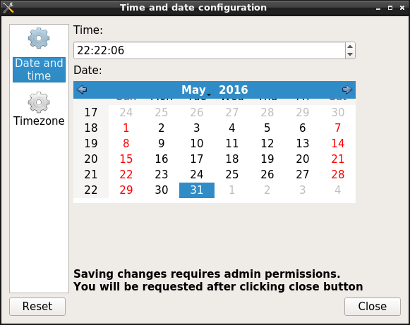
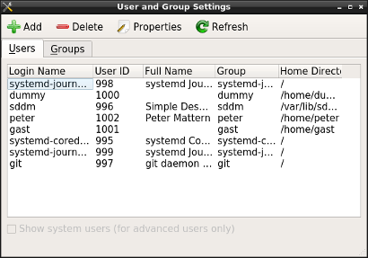

# lxqt-admin

## Overview

This repository is providing two GUI tools to adjust settings of the operating system LXQt is running on.

"Time and date configuration", binary `lxqt-admin-time`, can adjust system time and timezone.

It is using `systemd-timedated` as backend which is accessed by its D-Bus interface. Among other this means the option
to sync the system time by NTP is relying on `systemd-timesyncd` as backend.

In "User and Group Settings", binary `lxqt-admin-user`, users and groups of the operating system can be modified.

The backend is a script `lxqt-admin-user-helper`. By default it is in turn using the shadow tools to do the actual work.
The script can be modified to use different tools, though.

Both are using [polkit](https://www.freedesktop.org/wiki/Software/polkit/) to handle permissions. So polkit and a corresponding
authentication agent are needed at runtime. As for LXQt sessions [lxqt-policykit](https://github.com/lxde/lxqt-policykit/)
is the first choice.

Earlier versions of lxqt-admin were relying on [system-tools-backends](http://system-tools-backends.freedesktop.org)
and their wrapper [liboobs](https://github.com/GNOME/liboobs). These were replaced as both go unmaintained for years and
were hence dropped from many distributions heavily restricting the usage of lxqt-admin.   
As long as they can be built it should still be possible to compile lxqt-admin release ≤ 0.10 against them in order
to make use of it on platforms lacking systemd like BSD.

## Installing

### Compiling sources

Build dependencies are Git, CMake, qttools to handle localization as well as library [liblxqt](https://github.com/lxde/liblxqt)
and its dependency [libqtxdg](https://github.com/lxde/libqtxdg).   
By default lxqt-admin is pulling translations from repository [translations](https://github.com/lxde/translations/) at
compile time, see file README.md of the latter.

To compile, run `cmake`, `make` and `make install`.
`cmake` can be invoked in an out of source build directory and will normally need variable `-DCMAKE_INSTALL_PREFIX=/usr`.
`make install` can be invoked with `DESTDIR=<some path>`.

### Binary packages

#### Arch Linux

[AUR](https://aur.archlinux.org) packages `lxqt-admin` and `lxqt-admin-git` are providing the current stable release and the
actual master checkout at compile time as usual.   
Note that package `lxqt-admin` had to be kept in the AUR due to lack of the dependency liboobs as depicted [above](#overview).
So it will be transferred to community as of release 0.11.

#### Debian

Package `lxqt-admin` is available in the official repositories as of Debian stretch.

#### Fedora

Fedora doesn't provide lxqt-admin so far due to lack of the dependency liboobs as depicted [above](#overview). This will hopefully change
once release LXQt release 0.11 makes it into the Fedora repositories.

#### openSUSE

openSUSE does not ship with lxqt-admin in it's standard repositories since the functionality is covered by openSUSE's [YaST](http://yast.github.io/).
However it is still possible to install it on openSUSE. The package and its dependencies, like the [above](#overview) mentioned, outdated liboobs are available through the [X11:LXQt](https://build.opensuse.org/project/show/X11:LXQt) repository.

## Usage

Both GUIs can be launched from GUI "Configuration Center" of [lxqt-config](https://github.com/lxde/lxqt-config) and are available
in LXQt panel's main menu at Preferences - LXQt settings as well.

The actual usage should be self-explanatory. To apply settings the GUI of the polkit authentication agent that's in use is
launched to acquire the root password.
